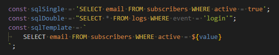

# SQL Highlight

SQL Highlight is a Visual Studio Code extension that detects SQL inside JavaScript and TypeScript string literals and applies SQL syntax highlighting.

## What It Does

- Detects SQL in regular strings and template literals.
- Highlights SQL keywords such as SELECT, WITH, INSERT, UPDATE, DELETE, CREATE, ALTER, DROP, and transaction statements.
- Handles multiline template strings where SQL starts on a new line.
- Supports JavaScript interpolation inside template literals (for example `${value}`) while keeping SQL highlighting active.

## Language Coverage

Current injection targets are:

- JavaScript (`source.js`)
- JavaScript React (`source.jsx`, `source.js.jsx`)
- TypeScript (`source.ts`)
- TypeScript React (`source.tsx`)

Note: this extension does not automatically support every programming language. TextMate injections are scope-based, so each language must be explicitly targeted.

## Screenshots

Current SQL colorization sample:



Recommended filenames:

- `images/before.png`
- `images/after-colorized.png`

## Examples

Before (plain string, no SQL tokenization):

```js
const q = "SELECT id, name FROM users WHERE id = 1";
// Appears as a normal JS string
```

After (colorized with SQL Highlight):

```js
const q = "SELECT id, name FROM users WHERE id = 1";
// Colorized as SQL: SELECT, FROM, WHERE and SQL identifiers/operators
```

Before (multiline template without SQL embedding):

```js
const q = `
SELECT id, name
FROM users
WHERE status = ${status}
`;
// Entire content appears like a regular template string
```

After (colorized, multiline SQL starts on a new line):

```js
const q = `
SELECT id, name
FROM users
WHERE status = ${status}
`;
// Colorized as SQL even when the first keyword starts on the next line
```

No activation keyword is required. You do not need markers like `/*sql*/` for inference to work.

## Customization

If your theme needs stronger contrast for embedded SQL, add token color rules in your `settings.json`.

```json
"editor.tokenColorCustomizations": {
    "textMateRules": [
        {
            "scope": [
                "source.sql.embedded.js"
            ],
            "settings": {
                "foreground": "#ABB2BF"
            }
        }
    ]
}
```

## Development

Build VSIX:

```bash
npm run build
```

Install local VSIX:

```bash
npm run install-ext
```

## License

MIT. See [LICENSE](./LICENSE).
